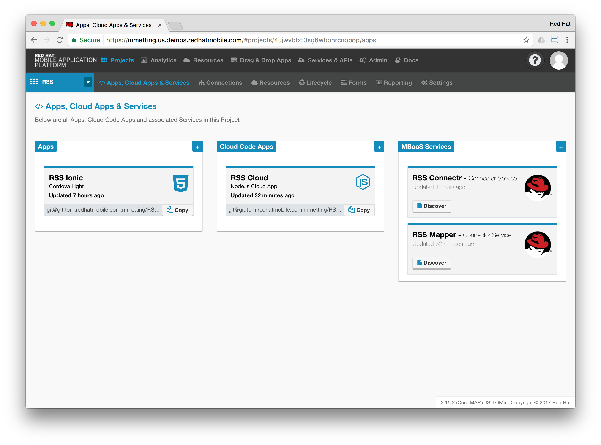

# RHMAP-Articles
## Building an Alexa Skill with Red Hat Mobile Application Platform

    <table>
        <td>
            
        </td>
        <td>
        Amazon’s Alexa enabled devices, such as the Echo, Dot and most recently Tap provide a hands-free voice controlled environment, to make calls, send and receive messages, provide information and more — instantly.

With some lines of code, developers are now able to integrate existing web services into an Alexa skill.
        </td>
    </table>

In this article series we'll leverage the [Alexa Skill SDK (ASK)](http://phx.corporate-ir.net/phoenix.zhtml?c=176060&p=irol-newsArticle&ID=2062551) to build Alexa skills providing news towards the end-user. Amazon’s voice service interacts with web services hosted in the Red Hat Mobile Application Platform (RHMAP).

 

> Skills come in different flavours:
>
> 1. *Flash Briefing*: These skills provide original content for users’ flash briefings.
> 2. *Smart Home*: With these skills, users can control cloud-enabled smart-home devices like lights and thermostats.
> 3. *Custom*: These skills can handle just about any type of request.

 

### Part 1: Starting with a Flash Briefing Skill

The Flash Briefing Skill API defines the words users say to invoke the flash briefing or news request and the format of the content so that Alexa can provide it to the user.

The news feeds in our sample come from a public RSS feed and were added to a mobile solution project within RHMAP via a re-usable connector.

A web service created by a developer only needs to adhere to the Flash Briefing Skill API to provide information to the user.

This can easily be done by utilising the RHMAP API Mapper Service template.

[Read more ...](https://github.com/mmetting/Building-an-Alexa-skill-with-Red-Hat-MAP---Part-I)

 

### Part 2: Upgrading to a Custom Skill

Continuing our journey to build Alexa Skills, we’ll leverage the Alexa Skill SDK (ASK) to create a Custom Skill providing news towards our end-user.

Where-as Flash Briefing Skills are quick to setup, their functionality is limited to only provide information without further user interaction.

To include custom user interactions, a Custom Skill is required: Developers define the requests the skill can handle (intents) and the words users say to invoke those requests (utterances).

Let’s extend our use case to build a Custom Skill to retrieve the desired RSS feeds.

[Read more ...](https://github.com/mmetting/Building-an-Alexa-skill-with-Red-Hat-MAP---Part-II)

 

### Part 3: Host your own Skill with RHMAP

Moving on to the enterprise space: Enterprises often have the requirements to host their services themselves.

Since RHMAP can expose web services to the internet and has the ability to include the Alexa Skill SDK (ASK), we can move our Alexa Skill fully under control:

- Decide on where we want to deploy it
- Leverage our own infrastructure
- Control user access
- Protect mission critical intellectual property
- Use existing infrastructure and resources

[Read more ...](https://github.com/mmetting/Building-an-Alexa-skill-with-Red-Hat-MAP---Part-I)

## RHMAP-BPM-Integration Using Sync
This is a [blog post](http://www.opensourcerers.org/red-hat-map-jboss-bpm-suite-integration-using-sync-framework/) that discuss how to make a mobile app getting regular updates on changes made in tasks and processes in Red Hat JBoss BPM, and how the `$fh.sync` framework can be used together with the [fh-connector-bpm](https://github.com/sebastianfaulhaber/fh-connector-bpm).
This is a simple way of building a process driven, asynchronous mobile app that can be used to push tasks to for example field personnel, call center staff etc.
